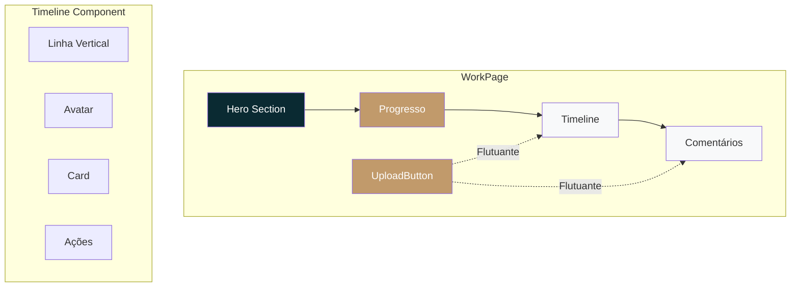

# Plano de Redesign Luxury/Refined para WorkPage

## Visão Geral
Redesign completo da página de acompanhamento de obra (`WorkPage.tsx`) com estética **luxury/refined**, seguindo as diretrizes da skill frontend-design. O novo layout será focado em mobile-first, timeline estilo Facebook, e integração visual com as cores inspiradas no site da OX Services.

## Direção Estética
- **Tonalidade**: Luxury/Refined com toques de editorial de revista.
- **Palavras-chave**: Sofisticado, elegante, limpo, espaçoso, distinto.
- **Diferenciação**: Uso de serifas elegantes para títulos, acentos dourados, gradientes sutis e composição espacial assimétrica.

## Paleta de Cores
Inspirada no site OX Services (#0B242A) com tons luxury:

| Cor | Hexadecimal | Uso |
|-----|-------------|-----|
| Primary | `#0A2A32` | Fundos escuros, textos principais |
| Primary Light | `#1A3A42` | Elementos hover |
| Primary Dark | `#051A22` | Ênfase |
| Secondary | `#C19A6B` | Acentos, botões, bordas |
| Secondary Light | `#D4B48C` | Acentos claros |
| Secondary Dark | `#A87C4A` | Acentos escuros |
| Neutral White | `#FFFFFF` | Fundo de cards |
| Neutral Ice | `#F8F9FA` | Fundo geral |
| Neutral Light | `#E9ECEF` | Bordas suaves |
| Neutral Medium | `#6C757D` | Texto secundário |
| Neutral Dark | `#343A40` | Texto principal |
| Background Light | `#F8F9FA` | Modo claro |
| Background Dark | `#0A2A32` | Modo escuro (opcional) |

## Tipografia
- **Títulos (Display)**: `Playfair Display` (serif) – pesos 400, 700.
- **Corpo (Body)**: `Inter` (sans-serif) – pesos 300, 400, 500, 700.
- **Fallback**: `serif`, `sans-serif`.

**Links Google Fonts**:
```html
<link href="https://fonts.googleapis.com/css2?family=Playfair+Display:wght@400;700&family=Inter:wght@300;400;500;700&display=swap" rel="stylesheet">
```

## Estrutura da Página (Mobile-First)

### Layout Simplificado
1. **Hero Section Compacta**
   - Imagem de fundo com overlay escuro.
   - Título da obra, cliente, datas e status em cartões horizontais scrolláveis (mobile) ou grid (desktop).
   - Indicador de progresso circular ou barra horizontal.

2. **Seção de Progresso**
   - Barra de progresso horizontal com porcentagem.
   - Estatísticas em grid de 2 colunas (mobile) ou 4 colunas (desktop).

3. **Timeline (Estilo Facebook Luxury)**
   - Linha vertical à esquerda (fina, cor secondary).
   - Avatar circular com iniciais ou ícone.
   - Card de conteúdo à direita (ou abaixo em mobile) com:
     - Cabeçalho: nome do autor, data, tipo de entrada.
     - Mídia (imagem/vídeo) com bordas arredondadas.
     - Descrição.
     - Ações: Curtir, Comentar, Compartilhar (ícones elegantes).
   - Animação de entrada stagger.

4. **Seção de Comentários**
   - Cartões com bordas sutis, sombras suaves.
   - Formulário com inputs estilizados.
   - Lista de comentários com avatar, nome, data e ações.

5. **Upload Button Flutuante**
   - Botão circular com gradiente secondary.
   - Modal de upload com design refinado.

### Grid Responsivo
- **Mobile (default)**: Coluna única, padding lateral 1rem.
- **Tablet (≥768px)**: Coluna única com largura máxima 720px.
- **Desktop (≥1024px)**: Grid de 2 colunas (70% timeline / 30% sidebar) ou layout single-column com largura máxima 1200px.

## Componentes Redesenhados

### Timeline.tsx
- Substituir linha vertical centralizada por linha à esquerda.
- Avatar circular com gradiente secondary.
- Card com fundo branco, borda `1px solid #E9ECEF`, sombra suave.
- Ações com ícones de `Heart`, `MessageCircle`, `Share2`.
- Animação de expandir/colapsar suave.

### CommentSection.tsx
- Atualizar cores para usar paleta luxury.
- Inputs com bordas arredondadas, foco com cor secondary.
- Cartões de comentário com background branco, borda sutil.
- Avatar com gradiente baseado no nome.

### UploadButton.tsx
- Botão flutuante com gradiente `secondary`.
- Modal com backdrop blur, border-radius grande.
- Formulário com inputs estilizados.
- Progress bar com gradiente.

## Tema CSS Luxury
Arquivo `src/styles/luxury-theme.css` contendo:

- Variáveis CSS para cores, fontes, espaçamento.
- Classes utilitárias (`luxury-card`, `luxury-btn`, `luxury-input`).
- Animações (`fade-in-up`, `stagger`).
- Responsividade.

## Implementação Passo a Passo

1. **Criar arquivo de tema**
   - Definir variáveis CSS no `:root`.
   - Adicionar classes base.

2. **Atualizar WorkPage.tsx**
   - Remover classes industriais, substituir por luxury.
   - Reestruturar HTML para mobile-first.
   - Incluir novas fontes via link no `index.html`.

3. **Refatorar Timeline.tsx**
   - Ajustar estrutura JSX para novo layout.
   - Aplicar classes CSS do tema.

4. **Refatorar CommentSection.tsx**
   - Atualizar cores e estilos.

5. **Refatorar UploadButton.tsx**
   - Ajustar cores e estilos do modal.

6. **Testes**
   - Verificar responsividade em viewports 320px, 768px, 1024px, 1440px.
   - Testar contrastes de cor (WCAG AA).
   - Validar acessibilidade (ARIA labels, focus).

7. **Integração e Deploy**
   - Garantir que o build do projeto não quebre.
   - Testar em navegadores (Chrome, Firefox, Safari).

## Diagrama da Nova Estrutura



## Considerações de Acessibilidade
- Contraste mínimo 4.5:1 para texto.
- Labels ARIA para ícones.
- Navegação por teclado nos botões.
- Suporte a `prefers-reduced-motion`.

## Próximos Passos
1. Revisar este plano com o usuário.
2. Ajustar conforme feedback.
3. Mudar para modo **Code** para implementação.

---

*Plano criado em 26/01/2026 – Modo Architect*