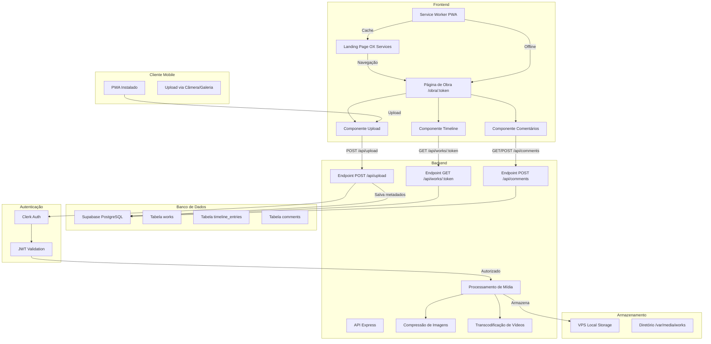

# Plano de Implementação: Página de Acompanhamento de Obra

## Visão Geral
Sistema para clientes visualizarem o desenvolvimento de suas obras através de uma timeline com fotos e vídeos, com capacidade de upload via app PWA (com autenticação Clerk) e comentários restritos. A página será acessível via subdomínio `obras.oxservices.org` e as mídias armazenadas localmente no VPS.

## Arquitetura do Sistema



## Fluxo de Dados

1. **Cliente recebe token** (ex: via email) com link `https://obras.oxservices.org/obra/{token}`.
2. **Acesso à página**: frontend busca dados da obra e timeline via API.
3. **Visualização**: timeline exibe fotos/vídeos ordenados por data.
4. **Upload de mídia** (apenas usuários autenticados via Clerk):
   - Funcionário acessa app PWA, faz login via Clerk.
   - Seleciona foto/vídeo da câmera ou galeria.
   - Frontend envia para endpoint de upload com token JWT de Clerk.
   - Backend valida JWT, processa mídia (compressão/transcodificação), armazena no sistema de arquivos do VPS.
   - Cria entrada na tabela `timeline_entries`.
5. **Comentários** (apenas clientes com token válido):
   - Cliente preenche formulário com nome e comentário.
   - Frontend envia para endpoint de comentários (com token da obra).
   - Comentário é salvo na tabela `comments` e exibido na página.

## Componentes Frontend

### Rotas
- `/` – Landing page atual (App.tsx) – site principal oxservices.org.
- `/obra/:token` – WorkPage (novo componente) – disponível no subdomínio `obras.oxservices.org`.

### WorkPage
- **HeroSection**: imagem de fundo (cover_image_url), título da obra, informações.
- **Timeline**: componente vertical com entradas do tipo `image` ou `video`.
  - Cada entrada: card com thumbnail, título, descrição, data.
  - Vídeos: player com ReactPlayer.
- **CommentSection**:
  - Lista de comentários.
  - Formulário para adicionar comentário (exige token válido da obra).
- **UploadButton** (condicional): exibido apenas se usuário autenticado via Clerk (funcionário). Abre modal para seleção de arquivo.

### Gerenciamento de Estado
- React Query para fetching de dados (obra, timeline, comentários).
- Contexto para armazenar token de obra e estado de autenticação Clerk.

## Backend

### Endpoints
| Método | Rota | Descrição | Autenticação |
|--------|------|-----------|--------------|
| GET | `/api/works/:token` | Retorna obra e timeline | Token na URL (público) |
| POST | `/api/works/:token/upload` | Upload de mídia | Clerk JWT + token obra (opcional) |
| GET | `/api/works/:token/comments` | Lista comentários | Público |
| POST | `/api/works/:token/comments` | Adiciona comentário | Token válido da obra |

### Processamento de Mídia
- **Imagens**: redimensionamento (max 1920px), compressão (qualidade 80%) com Sharp. Limite: 20MB.
- **Vídeos**: transcodificação para MP4 H.264, geração de thumbnail com FFmpeg. Limite: 250MB.
- **Armazenamento**: Sistema de arquivos local do VPS (ex: `/var/media/works/{work_id}/{timestamp}_{filename}`). URLs servidas via express.static em `/media`.

### Autenticação
- **Token de obra**: UUID único, usado para acesso público e comentários. Middleware `validateToken` verifica correspondência na tabela `works`.
- **Clerk**: Para upload, exige header `Authorization: Bearer <clerk_jwt>`. Middleware `clerkAuth` valida JWT via SDK Clerk e verifica se o usuário tem permissão (role `uploader`). O token da obra pode ser passado via query param para associar a obra correta.

### Subdomínio e Deploy
- Frontend (PWA) hospedado no mesmo VPS (Hostinger) sob subdomínio `obras.oxservices.org`.
- Backend roda na mesma instância (Node.js) em porta diferente (ex: 4000) com proxy reverso Nginx.
- Arquivos estáticos de mídia servidos por Nginx diretamente do diretório `/var/media/works`.

## Banco de Dados

### Schema Supabase
```sql
CREATE TABLE works (
    id UUID PRIMARY KEY DEFAULT gen_random_uuid(),
    name TEXT NOT NULL,
    description TEXT,
    client_name TEXT,
    client_email TEXT,
    start_date DATE,
    end_date DATE,
    status TEXT CHECK (status IN ('planned', 'in_progress', 'completed')),
    cover_image_url TEXT,
    access_token UUID UNIQUE NOT NULL DEFAULT gen_random_uuid(),
    created_at TIMESTAMPTZ DEFAULT NOW(),
    updated_at TIMESTAMPTZ DEFAULT NOW()
);

CREATE TABLE timeline_entries (
    id UUID PRIMARY KEY DEFAULT gen_random_uuid(),
    work_id UUID REFERENCES works(id) ON DELETE CASCADE,
    type TEXT CHECK (type IN ('image', 'video', 'note')),
    media_url TEXT,
    thumbnail_url TEXT,
    title TEXT,
    description TEXT,
    date TIMESTAMPTZ DEFAULT NOW(),
    created_at TIMESTAMPTZ DEFAULT NOW(),
    "order" INTEGER
);

CREATE TABLE comments (
    id UUID PRIMARY KEY DEFAULT gen_random_uuid(),
    work_id UUID REFERENCES works(id) ON DELETE CASCADE,
    author_name TEXT NOT NULL,
    author_email TEXT,
    content TEXT NOT NULL,
    created_at TIMESTAMPTZ DEFAULT NOW(),
    approved BOOLEAN DEFAULT TRUE
);
```

## PWA (Progressive Web App)

### Funcionalidades
- Instalação via "Adicionar à tela inicial".
- Cache de assets estáticos (CSS, JS, imagens) para funcionamento offline.
- Service Worker com estratégia Cache First para assets, Network First para API.
- Suporte a upload de mídia usando API de arquivos/câmera nativa.
- Autenticação via Clerk (login social ou email).

### Configuração
- Plugin `vite-plugin-pWA` no Vite.
- Manifest `public/manifest.webmanifest` com ícones e metadados.
- Service Worker gerado automaticamente.
- Integração com Clerk SDK para autenticação.

## Sequência de Implementação

1. **Configuração inicial**
   - Configurar subdomínio `obras.oxservices.org` no VPS (DNS, Nginx).
   - Adicionar React Router ao projeto frontend.
   - Criar estrutura de pastas para novos componentes (`pages/`, `components/timeline/`, etc.).

2. **Backend**
   - Criar novas tabelas no Supabase.
   - Implementar endpoints básicos (GET work, GET timeline).
   - Implementar middleware de autenticação por token de obra.
   - Integrar Clerk SDK para autenticação JWT.
   - Implementar upload com processamento de mídia (Sharp, FFmpeg).
   - Configurar armazenamento local e servir arquivos estáticos.
   - Implementar endpoints de comentários.

3. **Frontend**
   - Criar página WorkPage com rota `/obra/:token`.
   - Componente Timeline.
   - Componente CommentSection.
   - Integração com API usando React Query.
   - Integração Clerk para autenticação de upload.
   - Configurar PWA (service worker, manifest).

4. **PWA**
   - Configurar plugin PWA.
   - Testar instalação e funcionamento offline.
   - Implementar upload via câmera com Clerk auth.

5. **Testes e deploy**
   - Testar fluxo completo (visualização, upload, comentários).
   - Deploy no VPS (frontend e backend).
   - Configurar Nginx para servir frontend e proxy para API.

## Considerações de Segurança
- Validação de tipos de arquivo (somente imagens e vídeos).
- Limites de tamanho (20MB imagem, 250MB vídeo).
- Sanitização de inputs (XSS).
- Token único e secreto, tratar como senha.
- Clerk JWT validation com segregação de roles.
- Armazenamento local com permissões adequadas (somente leitura pública).

## Próximos Passos
1. Revisar este plano ajustado.
2. Ajustar requisitos conforme feedback.
3. Iniciar implementação (modo Code).